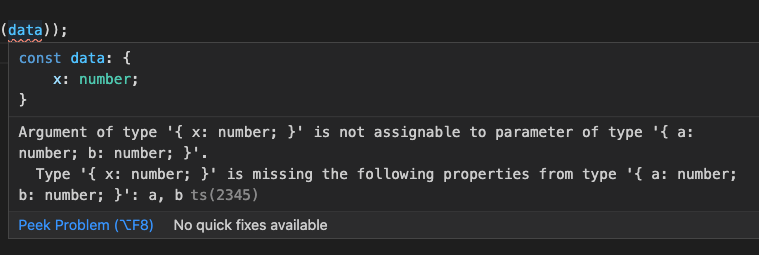
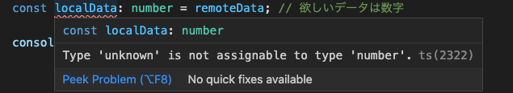
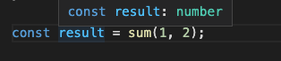
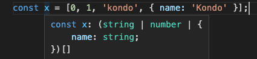
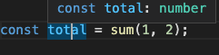
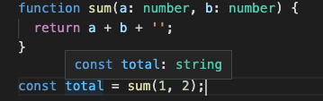
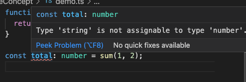
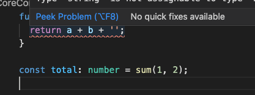

# 重要概念

まず例で`TypeScript`の重要概念を説明しましょう。

ピタゴラスの定理のプログラム：

```javascript
function pythagorean(triangle) {
  return Math.sqrt(triangle.a ** 2 + triangle.b ** 2);
}

const triangle = { x: 3, y: 4 };
console.log(pythagorean(data));
```

上記の例は、`y`がないのに、`JavaScript`の場合実行するまで（最悪プロダクションにシップ）、その誤りに気が付かないでしょう。しかし、`TypeScript`の場合、コーディング段階で、そのミスを発見することができます。

```typescript
function pythagorean(data: { a: number; b: number }) {
  return Math.sqrt(data.a ** 2 + data.b ** 2);
}

const data = { x: 3 };
console.log(pythagorean(data));
```



`TypeScript`は、厳密な言語なので、**事前に潜在なバグを防止することができる**のが一番の利点です。ですから、エンタープライズレベルの開発に大人気です。

`TypeScript`のコアコンセプトは、全てのデータは**静的タイプ**を持っています。違うタイプ間の**相互代入不可能**です。（注：トップタイプは除外）。

## [タイプアノテーション](https://www.typescriptlang.org/docs/handbook/2/everyday-types.html)

`Python`の[typing](https://docs.python.org/ja/3/library/typing.html)と類似するように、関数や変数のタイプアノテーションをする機能です。しかしながら、`Python`の方はタイプアノテーションを強制しませんが、`TypeScript`はタイプアノテーションを強制しています。要するに、タイプアノテーションは`TypeScript`コンパイルにデータの型を伝えます。

### 1. 変数のタイプアノテーション

`const | let 変数名: タイプ`のように変数を宣言時にタイプアノテーション。

```typescript
const age: number = 100;
let name: string;
```

### 2. 関数関連のタイプアノテーション

- 関数パラメーター:
  - 普通の関数: `function 関数名(パラメータ名: タイプ, ...) {}`
  - アロー関数: `const 関数名 = (パラメータ名: タイプ, ...) => {}`
- 関数の戻り値
  - 普通の関数: `function 関数名(): タイプ {}`
  - アロー関数: `const 関数名 = (): タイプ => {}`

```typescript
//普通関数
function sum(a: number, b: number): number {
  return a + b;
}

// アロー関数
const pythagorean = (a: number, b: number): number => a ** 2 + b ** 2;

// 分割代入
function sum({
  firstNumber,
  secondNumber,
}: {
  firstNumber: number;
  secondNumber: number;
}): number {
  return firstNumber + secondNumber;
}

console.log(sum({ firstNumber: 1, secondNumber: 2 }));
```

## タイプの種類

### 1. ベースタイプ

数値を表すタイプです。`TypeScript`において一番基本となるタイプです。

- number:

  ```typescript
  const decimal: number = 10;
  const hex: number = 0xffffff;
  const binary: number = 0b101;
  const octal: number = 0o555;
  const double: number = 3.1415926;
  ```

- string:

  ```typescript
  const name: string = "Kondo"; // 普通の文字列
  const gender: string = `male`; //テンプレートリテラル

  // 変数つきテンプレートリテラル
  const age: number = 18;
  const phrase: string = `I am ${number} years old.`;
  ```

- boolean:

  ```typescript
  const yes: boolean = true;
  const no: boolean = false;
  ```

- undefined:
  
  ```typescript
  let zoneName: undefined;
  ```

- null:

  ```typescript
  let leakData: null;
  ```

  上記`null`と`undefined`を独自で使用するのはあまり意味がないので、一般的に`Union Type`の形でガードとして使われています。

  ```typescript
  let dataFromApi: number | null | undefined;
  ```

  `Union Type`はこの後説明します。

- [symbol](https://developer.mozilla.org/ja/docs/Web/JavaScript/Reference/Global_Objects/Symbol): 唯一な値を作るのに使われています。

  ```typescript
  const role1: symbol = Symbol();
  const role2: symbol = Symbol();
  console.log(role1 === role2);
  ```

### 2. オブジェクトタイプ

JavaScriptの基本的な概念として数値型以外は全部オブジェクトです。

- Array:

  ```typescript
  const pureArray: number[] = [1, 2, 3]; // 中身は全部数字
  const mixArray: (number | string)[] = [1, '2', 3]; //中身は混在】
  const objectArray: { id: string; pwd: string }[] = [{ id: 'FGL', pwd: '123' }]; // オブジェクト
  const twoDimensionArray: number[][] = [[1, 2], [3, 4]];
  ```

- [2. タプル](https://www.typescriptlang.org/docs/handbook/basic-types.html#tuple)

  要素の個数・型が決められた配列です。

  ```typescript
  const userInfo: [string, string, number] = ['Kondo', 'male', 18];
  ```

  タプルは`CSV`関係のデータ処理によく使われています。
  
  ```typescript
  const csvData: [string, string, number][] = [
    ['Kondo', 'male', 18],
    ['Zhao', 'male', 20],
  ];
  ```

- Object:

  ```typescript
  const member: {
    name: string;
    age: number;
  } = {
    name: "Kondo",
    age: 18,
  };

  console.log(member);
  ```

- Function:

  ```typescript
  const sum: (a: number, b: number) => number = (a, b) => a + b;
  console.log(sum(1, 2));
  ```

- void：`C言語`のような戻り値がない関数を宣言する時に使われます。

  ```typescript
  // 普通の関数
  function displayName(name: string): void {
    console.log(name);
  }
  ```

## トップタイプ

任意の値を代入できるタイプです。データのタイプが確定されていない時に使います。

- any: 値はどんな型とも相互変換可能であり、`TypeScript`のコンパイラーより型チェックを無視することに相当します(root権限みたい)。

  ```typescript
  let data: any = 100;
  data = 'Kondo';
  ```

  **注意：`any`タイプを使うと、`TypeScript`を使っている意味が薄れてしまいますので、使わないでください、やむを得ない場面で`unknown`を使うこと。**

- unknown: 任意の値を代入でますが、[型アサーション](https://www.typescriptlang.org/docs/handbook/basic-types.html#type-assertions)が無いと利用できません。
  型アサーションは、`Type Cast`と似ているように、コンパイラーに「このデータのタイプはもう確定したので、チェックしないでください」と伝えています。

  C言語の`Type Cast`:

  ```c
  int sendData = 10;
  printf("%f\n", (float)sendData / 2);
  ```
  
  型アサーションの例:

  ```typescript
  let sendData: unknown;

  sendData = 5;
  console.log(sendData + 1); // コンパイルエラーが発生
  console.log(sendData as number + 1); // assertion後使えます

  sendData = 'Kondo';
  console.log(sendData.length); // コンパイルエラーが発生
  console.log((sendData as string).length); // assertion後使えます。
  ```
  
  時々、APIからのデータのタイプは不明なので、その時`unkonwn`を活用できます。

  ```typescript
  const remoteData: unknown = '2'; // リモートデータ、文字列か数字かは不明
  let localData: number = 0 ; // 初期値の設定は必須、欲しいデータは数字

  if (typeof remoteData === "string") {
    localData = parseInt(remoteData);
  } else if (typeof remoteData === "number") {
    localData = remoteData;
  }

  console.log(localData + 1);
  ```

- `any`と`unknown`の比較
  `any`と`unknown`は同じ`top type`ですが、`unknown`は`any`よりセーフ。

  ```typescript
  const remoteData: any = "2"; // リモートデータ、文字列か数字かは不明
  const localData: number = remoteData; // 代入
  console.log(localData + 1);　//21
  ```

  `any`を使うと、何もエラーがありません、結局プロダクションにシップしてしまう可能性が高いです。
  同じコードで、`unknown`を使うと

  ```typescript
  const remoteData: unknown = "2"; // リモートデータ、文字列か数字かは不明
  const localData: number = remoteData; // コンパイルエラーが発生
  console.log(localData + 1);
  ```

  

## [ボトムタイプ](https://www.typescriptlang.org/docs/handbook/basic-types.html#never)

プログラミング言語の設計には、bottom型の概念があります。それは、絶対に起こらない型です。TypeScriptはデータフロー解析を実行するので、決して起こりえないようなものを確実に表現する必要があります、それは`never`です。

- never:
  - `return`できない関数（例：無限ループ）
  - エラーを投げる

下記の網羅チェックの例をみてみましょう。

```typescript
function errorEmitter(message: string): never {
  throw new Error(message);
}

function typeCheck(x: unknown): boolean {
  if (typeof x === "string") {
    return true;
  } else if (typeof x === "number") {
    return false;
  }
  return errorEmitter("Type error.");
}

typeCheck({});
```

## [タイプインファレンス](https://www.typescriptlang.org/docs/handbook/type-inference.html)

`TypeScript`はソースコードのコンテキストからタイプを推測することができます。

```typescript
function sum(a: number, b: number) {
  return a + b;
}
const result = sum(1, 2);
```

sum関数の戻り値のアノテーションをしていないですが、`TypeScript`はパラメーターより`number`と判断しました。


もっと良い例:

```typescript
const x = [0, 1, 'kondo', { name: 'Kondo' }];
```



タイプインファレンスは必ずしも正しくないです。

```typescript
function sum(a: number, b: number) {
  return a + b;
}
const total = sum(1, 2);　// 数字3は期待値
```

ここで、`total`のタイプが推測されました。



もし、コーディングミスで、下記のコードだと

```typescript
function sum(a: number, b: number) {
  return a + b + '';
}

const total = sum(1, 2);　// 数字3は期待値
```

ここで、`total`は`string`と推測されました、またエラーもありません。



当然`total`の型を指定したらエラーのヒントがありますが

```typescript
function sum(a: number, b: number) {
  return a + b + '';
}
const total: number = sum(1, 2);
```



悪いのは関数ですので、関数の戻り値を**常にタイプアノテーションする**ことを推奨します。

```typescript
function sum(a: number, b: number): number {
  return a + b + '';
}
const total: number = sum(1, 2);
```

こうすることで、問題が発生する場所を特定できました。


