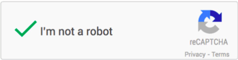
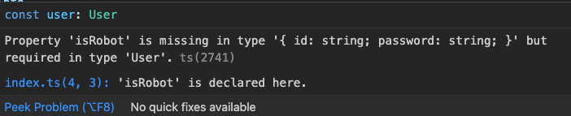
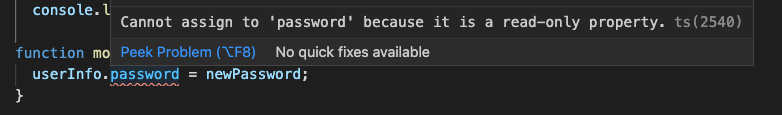
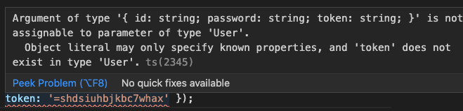

# インターフェース

## オブジェクトタイプインターフェイス

インターフェイスを説明する前に、ログイン画面の実例を見てみましょう。

```typescript
const login: (userInfo: { id: string; password: string }) => void = (
  userInfo
) => console.log('Login succeed!', userInfo);

function modifyPassword(
  userInfo: { id: string; password: string },
  newPassword: string
): void {
  userInfo.password = newPassword;
}

const user: { id: string; password: string } = {
  id: 'cho.chubun',
  password: '12345',
};

login(user);
```

上の例を見ると、`{ id: string; password: string }`を何度も使いました。繰り返し書くのは面倒なので、
こんなとき、`Interface`が使えます。

```diff
+ interface User {
+ id: string;
+ password: string;
+ }

- const login: (userInfo: { id: string; password: string }) => void = (
+ const login: (userInfo: User) => void = (
  userInfo
) => console.log('Login succeed!', userInfo);

- function modifyPassword(
-   userInfo: { id: string; password: string },
-   newPassword: string
- ): void {
+ function modifyPassword(userInfo: User, newPassword: string): void {
  userInfo.password = newPassword;
}

- const user: { id: string; password: string } = {
+ const user: User = {
  id: 'cho.chubun',
  password: '12345',
};

login(user);
```

例のように、[インターフェイス](https://www.typescriptlang.org/docs/handbook/interfaces.html#our-first-interface)オブジェクトの構造を宣言するのに使われます。

### [1. Optional Property](https://www.typescriptlang.org/docs/handbook/interfaces.html#optional-properties)

Bot ではないかを検証するチェックボクスはよくでますので、対応するため、インターフェースを少し改造しましょう。



```diff
interface User {
  id: string;
  password: string;
+ isRobot: boolean;
}
```



改造後、エラーが起こりました。しかし、Bot 検証は必ずしも毎回表示しませんので、単純に`isRobot`を追加しても NG です。確定されていないスキーマに対応するためにはどうしたらよいでしょうか。

一つの解決策は、もう一つのインターフェイスを定義して、ユニオンタイプで実現できます。
しかしながら、もしもう一つの情報を追加すると、もう一つインターフェイスが必要なので、複雑になってしまいます。
TypeScript は[Optional Property]が用意され、それを使うことで解決できます。

```diff
interface User {
  username: string;
  password: string;
- isRobot: boolean;
+ isRobot?: boolean;
}
```

### 2. readonly

`TypeScript`では、インターフェースを`readonly`として宣言できます、`readonly`で宣言された`properity`は修正できません。

```diff
interface User {
  id: string;
- password: string;
+ readonly password: string;
  isRobot?: boolean;
}
```

`password`を`readonly`で宣言すると`modifyPassword`にエラーが起こります。



### 3. 分割代入時の注意点

`TypeScript`の型チェックはコンテキストにより厳しさは変動しています。下記の例を見てみましょう。まず、`user`の`User`を外して、さらに`token`の属性を追加しましょう。

```diff
- const user: User = {
+ const user = {
  id: 'cho.chubun',
  password: '12345',
+ token: '=shdsiuhbjkbc7whax',
};
```

`login`のパラメータの型は`User`なのに、エラーが起こりません、しかし分割代入すると。

```diff
- login(user);
+ login({ id: 'cho.chubun', password: '12345', token: '=shdsiuhbjkbc7whax' })
```

エラーが起こりました。



分割代入の時に、型チェックは厳しくなるようです。

### 4.  索引付け可能タイプ

`token`の様な確定されていない属性がある場合、下記の様に索引付け可能タイプを使いましょう。

```diff
interface User {
  id: string;
  password: string;
  isRobot?: boolean;
+ [props: string]: any;
}
```

`props`は単なる変数名のため、命名規則に反しない限り、なんでも使えます。

```diff
interface User {
  id: string;
  password: string;
  isRobot?: boolean;
- [props: string]: any;
+ [kondo: string]: any;
}
```

## 関数タイプ

オブジェクトだけではなく、インターフェースは関数タイプも宣言することができます。

``` typescript
interface ShowMessage {
  (code: number): string;
}
```

`ShowMessage`タイプの関数を作成します。

```typescript
const showErrorMessage: ShowMessage = (code) => {
  if (code === 404) {
    return 'Not Found.';
  }
  if (code === 500) {
    return 'Server Error.';
  }
  return 'Code Not Found.'
};

```

## インターフェイスとは

上記の例を、[Playground](https://www.typescriptlang.org/play)を使って、コンパイルして結果見てみましょう。

```javascript
"use strict";
const login = (userInfo) => console.log('Login succeed!', userInfo);
function modifyPassword(userInfo, newPassword) {
    userInfo.password = newPassword;
}
const user = {
    id: 'cho.chubun',
    password: '12345',
};
login(user);
const showErrorMessage = (code) => {
    if (code === 404) {
        return 'Not Found.';
    }
    if (code === 500) {
        return 'Server Error.';
    }
    return 'Code Not Found.';
};
```

コンパイルされたコード見ると、`interface`に関連するコードがないですね。
要するに、`interface`は`TypeScript`が用意した注釈ツールです。`interface`は`Run time`に影響しません。
