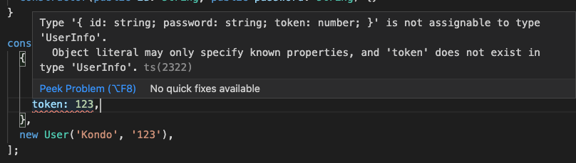

# オブジェクト指向プログラミング

`TypeScript`はオブジェクト指向に対応します。これからいくつかの概念を紹介します。

## Class

`TypeScript`でクラスは幅広く使われています。クラスの宣言は下記通りです。

```typescript
class User {
  username = 'Kondo';
  password = '123';
}
```

クラスメソッドの提言：

```diff
class User {
  username = 'Kondo';
  password = '123';
  
+ getUsername() {
+   return this.username;
+ }
}
```

 `new`演算子でクラスのインスタンスを作成します。

 ```typescript
 const user = new User();
 ```

このuserの型は`User`です。


`.`でクラスメソッドをコールします。

```typescript
console.log(user.getUsername());
```

## 継承

`extends` 演算子でクラスの継承ができます。引き続き上記のクラスで、VIPユーザのクラスを作りましょう。

```diff
class User {
  username = 'Kondo';
  password = '123';
  getUsername() {
    return this.username;
  }
}

+ class VipUser extends User {
+   getUserType() {
+     return 'I am VIP';
+   }
+ }

const user = new User();
+ const vip = new VipUser();

console.log(vip.getUsername());
+ console.log(vip.getUserType());

```

実行した結果を見ると、`VipUser`で作成したインスタンスに親の`User`の中のメソッドや属性も使えることができます。

## オーバーライド

継承した子クラスは、親クラスの属性やメソッドをオーバーライドすることが可能です。

```diff
  class VipUser extends User {
-   getUserType() {
-     return 'I am VIP';
-   }
+   getUsername() {
+     return `${this.username} and I am VIP.`
+   }
  }

  console.log(vip.getUsername());
- console.log(vip.getUserType());
```

実行した結果を見ると、親の`getUsername()`の名前と同じですが、子クラスの内容通り出力しました。

## constructor

`new`演算子でインスタンスを作成時、自動的に実行する関数です。インスタンスの初期化などによく使われています。上記の`User`クラスの属性は固定のため、違う情報を持つインスタンスが欲しいときは`constructor`を使いましょう。

```diff
  class User {
-   sername = 'Kondo';
-   password = '123';
+   username: string;
+   password: number;

+   constructor(username: string, password: number) {
+     this.username = username;
+     this.password = password;
+   }

```

`new User('Kondo', 123)`で`constructor`を実行します。

上記の`User`クラスの`username`と`password`は実際に下記の書き方の略です。

```typescript
public username: string;
public password: number;
```

`TypeScript`では、クラスの属性やメソッドの前に何も修飾子を書かない場合、`public`と認識されます。`constructor`は下記の様に省略できます。

```diff
  class User {
-   username: string;
-   password: number;

-   constructor(username: string, password: number) {
+   constructor(public username: string, public password: number) {}
-     this.username = username;
-     this.password = password;
-   }
```

この様な書き方は非常に簡潔ですが、注意すべきことはパラメータに必ず修飾子を入れることです。

## super

継承した`VipUser`のインスタンスを作成すると、エラーが起こりました。


原因は、親の`constructor`のパラメータが入ります。解決法は、子クラスにも`constrctor`を作成し、`super()`関数をコールします。`super()`は実の親の`constructor()`です。

```diff
  class VipUser extends User {
+   constructor(username: string, password: number) {
+     super(username, password);
+   }
    getUsername() {
      return `${this.username} and I am VIP.`;
    }
  }
```

もう少し、`VipUser`に`userType`の属性を追加します。

```diff
  class VipUser extends User {
-   constructor(username: string, password: number) {
+   constructor(username: string, password: number, public userType: string) {
      super(username, password);
    }
    getUsername() {
-     return `${this.username} and I am VIP.`;
+     return `${this.username} and I am ${this.userType}.`;
    }
  }
```

また、`super`で親の属性やメソッドにアクセスできます。上記の例で、`getUserName`はすでにオーバーライドされましたが、もし親の属性を使いたければ、その時`super`を活用しましょう。

```diff
  getUsername() {
-   return `${this.username} and I am ${this.userType}.`;
+   return `${super.getUsername()} and I am ${this.userType}.`;
  }
```

## アクセス修飾子

他のOOP言語と同じ様に、`TypeScript`でも`public`、`protected`、`private`が存在します。各修飾子のアクセス規則は下記通りです。

1. public: クラスの内部外部にも関わらず、クラスの属性やメソッドにアクセスすることができます、（修飾子がない場合`public`とします）。
2. protected：クラスの内部及びそのクラスを継承した子クラス内部からアクセスすることを可能とします。
3. クラス内部からのみ、アクセスが可能です。

直感的な例をあげましょう。`Company`というクラスがあります。外部公開できる情報は社名、資本金です。また公式Twiterで投稿できます、その場合`public`を使います。

```typescript
class Company {
  tweet: string;
  constructor(public name: string, public profit: number) {}
}

//外部
const headOffice = new Company('Fujitsu', 200); // 設立
console.log(headOffice.name); // 社名外部公開
console.log(headOffice.profit); // 資本金外部公開

headOffice.tweet = 'いいね'; // 公式ツイターでいいね投稿可能
```

会社は子会社を設立し、小会社に対する経営方針を作成します。その方針は本社と子会社しか公開しません、その場合、`protected`を使います。

```diff
  class Company {
    tweet: string;
+   protected policy = 'やりたい放題';
    constructor(public name: string, public profit: number) {}
  }
+ class Branch extends Company {
+   constructor(name: string, profit: number) {
+     super(name, profit);
+   }
+ }

  // 外部
  const headOffice = new Company('Fujitsu', 200); // 設立
  console.log(headOffice.name); // 社名外部公開
  console.log(headOffice.profit); // 資本金外部公開

  headOffice.tweet = 'いいね'; // 公式ツイターでいいね投稿可能

+ const branch = new Branch('FGL', 1000); // 子会社設立

+ console.log(headOffice.policy); // 外部方針を確認
+ console.log(branch.policy); // 外部方針を確認
```

直接外部から方針をアクセスするとエラーが起こります。


```diff
  class Company {
    tweet : string　='';
    protected policy = 'やりたい放題';
    constructor(public name: string, public profit: number) {}
+   showPolicy() {
+     console.log(this.policy);
+   }
  }

  class Branch extends Company {
    constructor(name: string, profit: number) {
      super(name, profit);
    }
+   showPolicy() {
+     console.log(this.policy);
+   }
  }

  // 外部
  const headOffice = new Company('Fujitsu', 200); // 設立
  console.log(headOffice.name); // 社名外部公開
  console.log(headOffice.profit); // 資本金外部公開

  headOffice.tweet = 'いいね'; // 公式ツイターでいいね投稿可能

  const branch = new Branch('FGL', 1000); // 子会社設立

- console.log(headOffice.policy); // 外部方針を確認
- console.log(branch.policy); // 外部方針を確認
+ headOffice.showPolicy();
+ branch.showPolicy();
```

最後は、本社内に機密情報を持っています。その情報は子会社にも公開できません。その場合`private`を使います。

```diff
  class Company {
    tweet : string　='';
    protected policy = 'やりたい放題';
+   private secret = '経営難航';
    constructor(public name: string, public profit: number) {}
    showPolicy() {
      console.log(this.policy);
    }
+   showSecret() {
+     console.log(this.secret);
+   }
  }

  class Branch extends Company {
    constructor(name: string, profit: number) {
      super(name, profit);
    }
    showPolicy() {
      console.log(this.policy);
    }
+   showSecret() {
+     console.log(this.secret);
+   }
  }
```

`Branch`クラスで親の`private`属性にアクセスしようとすると、エラーがおこります。


## getter & setter

`private`と`protected`属性は直接アクセスできないので、その属性を求める時に`getter`を使いましょう。

```typescript
class User {
  private _username = 'Kondo';
  private _password = '123';

  get username() {
    return this._username;
  }

  get password() {
    return this._password;
  }
}

const user = new User();

console.log(user.username);
console.log(user.password);
```

同様に、外部`private`の属性を修正したいときは、`setter`を使いましょう。

```typescript
class User {
  private _username = 'Kondo';
  private _password = '123';

  get username() {
    return this._username;
  }

  get password() {
    return this._password;
  }

  set username(username: string) {
    this._username = username;
  }

  set password(password: string) {
    this._password = password;
  }
}

const user = new User();
user.username = 'FGL';
user.password = '111';
console.log(user.username);
console.log(user.password);

```

`getter`と`setter`は`private`の属性を暗号化処理など、`private`属性を守るのに使われます。

## static

説明前に、例をみましょう。

```typescript
class Api {
  static root = '/site/v1.0,0/';
  static refLeakUuid = 'dfb9a315-3bf1-48e4-89da-da63eb9472a2';
  static preMaintUuid = '9ccb968a-f4e0-4158-811e-e87cd160861e';

  static getData(url: string): { id: String } {
    console.log(url);
    return {
      id: 'Kondo',
    };
  }

  static postData(url: string) {
    console.log('POST: ', url)
  }
}

Api.postData(`${Api.root}${Api.refLeakUuid}`);
```

`static`で修飾された属性やメソッドは`Api`のインスタンスを作成しなくても、使われます。`static`で修飾された属性やメソッドは静的属性または静的メソッドと言います。

静的属性（メソッド）は、プログラムを実行する時にメモリ上に存在しますが、クラスメソッドはインスタンスを作成時に生成されます。
下記の例を実行したら、エラーが起こります。

```diff
  class Api {
    static root = '/site/v1.0,0/';
    static refLeakUuid = 'dfb9a315-3bf1-48e4-89da-da63eb9472a2';
    static preMaintUuid = '9ccb968a-f4e0-4158-811e-e87cd160861e';
+   endMng: string;

- Api.postData(`${Api.root}${Api.refLeakUuid}`);
+ console.log(Api.endMng);
```


静的属性（メソッド）は関連性が高い属性やメソッドを集中管理するのによく使われます。

## 抽象

`TypeScript`も`abstract`があり、抽象クラスや抽象メソッドを宣言することができます。まず、例をみてみましょう。
下記の例で、図形の面積を求めるときに、式が違っていますが、面積を求めるという機能が共通です。こんな時、可読性が高く、変更しやすい抽象クラスを使いましょう。

```typescript
abstract class Area {
  constructor(public name: string) {}
  abstract getArea(): number;
}

class Circle extends Area {
  constructor(public r: number, name: string) {
    super(name);
  }
  getArea(): number {
    return Math.PI * this.r ** 2;
  }
}

class Triangle extends Area {
  constructor(public a: number, public h: number, name: string) {
    super(name);
  }
  getArea(): number {
    return this.a * this.h / 2.0
  }
}

class Square extends Area {
  constructor(public a: number, name: string) {
    super(name);
  }
  getArea(): number {
    return this.a ** 2;
  }
}

const circle = new Circle(10, 'Circle');
const triangel = new Triangle(3, 20, 'Triangle');
const square = new Square(20, 'Square');

console.log(circle.name, circle.getArea());
console.log(triangel.name, triangel.getArea());
console.log(square.name, square.getArea());
```

## クラスとインターフェイス

### implements

`implements`演算子で、インターフェイスを実装することができます。

```typescript
interface User {
  id: string;
  password: string;
}

class Client implements User {
  constructor(
    public id: string,
    public password: string,
  ) {}
}
```

実装さらたクラスに必ず`id`と`password`が要りますが、`id`と`password`を確保した上で、はかの属性を追加することができますが、インターフェースに定義されたメンバーがなければエラーが起こります。

```diff
  class Client implements User {
    constructor(
      public id: string,
-     public password: string,
+     public token: string;
    ) {}
  }
```

### インスタンスをオブジェクとして使用する

インスタンスはオブジェクとして使うのは可能です。

```typescript
interface UserInfo {
  id: string;
  password: string;
}

class User {
  constructor(public id: string, public password: string) {}
}

const user: UserInfo[] = [
  {
    id: 'Kondo',
    password: '123',
  },
  new User('Kondo', '123'),
];

console.log(user)
```

オブジェクトはインターフェイスに指定されていないメンガーあったらエラーがおきりますが、`User`はインターフェイスに指定されていないメンガーあっても、エラーが起きません。

```diff
+ const user: UserInfo[] = [
    {
      id: 'Kondo',
      password: '123',
+     token: 123,
    },
+   new User('Kondo', '123'),
```


