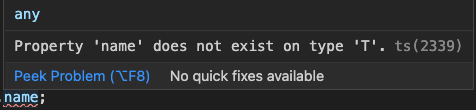
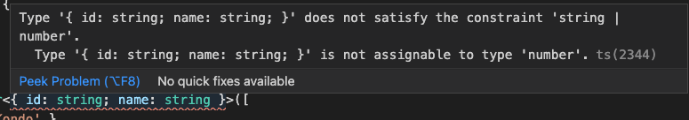

# Generic

## Genericとは

Genericは抽象的な型引数を使用して、実際に利用されるまで型が確定しない`関数`、`クラス`を実現する為に使用されます。

## 関数にGenericの使用

まず具体例を見てみましょう。

```typescript
function join(a: string | number, b: string | number): string {
  return `${a}${b}`;
}
```

join関数は`a`と`b`接続します。パラメータは`union`タイプのため、4パターンがあります。

- join(1, 2)
- join('1', '2')
- join('1', 2)
- join(1, '2')

現在、パラメータのタイプはまだ決めていないですが、必ず同じであるというニーズがあり、こんな時にGenericを使います。

```diff
- function join(a: string | number, b: string | number): string {
+ function join<T>(a: T, b: T): string {
    return `${a}${b}`;
  }
```

抽象的な**型引数**`<T>`を関数に与え、実際に利用されるまで型が確定しない関数を作成しています。`T`は引数なので、別の名称でも問題がありません。

```diff
  function join<T>(a: T, b: T): string {
    return `${a}${b}`;
  }

+ join<string>('1', '2');
+ join<number>(1, 2);

```

関数をコールするときに、具体的な型を指定しないといけません。またパラメータも指定されていた型と一致すること。

パラメータが配列の場合、書き方は2種類あります：

```typescript
function showElement<T>(list: T[]) {
  list.forEach((e: T) => console.log(e));
}
```

```typescript
function showElement<T>(list: Array<T>) {
  list.forEach((e: T) => console.log(e));
}
```

柔軟性を向上するために、複数の型引数を使用することも可能です。

```typescript
function join<T, P>(a: T, b: P): string {
  return `${a}${b}`;
}

join<string, number>('1', 2);
```

## クラスにGenericの使用

Genericを利用することで、クラスの柔軟性の設計に効果的に対処することができます。

例をみてみましょう。

```typescript
class DataManager {
  constructor(private data: number[]) {}

  getItem(index: number): number {
    return this.data[index];
  }
}

const data = new DataManager([1, 2, 3]);
console.log(data.getItem(1));
```

仕様が変わり、このクラスは`number`だけではなく、`string`にも対応したいです。その時はまず`union`タイプを思い出しましょう。

```diff
  class DataManager {
-   constructor(private data: number[]) {}
+   constructor(private data: number[] | string[]) {}

-   getItem(index: number): number {
+   getItem(index: number): number | string {
      return this.data[index];
    }
  }
```

これでしばらくは解決しますが、対応するタイプが追加されるびに、ソースコードを修正する必要があります。そのような柔軟性の課題を解決するために、`Generics`を活用しましょう。

```diff
- class DataManager {
+ class DataManager<T> {
-   constructor(private data: number[] | string[]) {}
+   constructor(private data: T[]) {}

-   getItem(index: number): number | string {
+   getItem(index: number): T {
    return this.data[index];
    }
  }

- const data = new DataManager([1, 2, 3]);
+ const data = new DataManager<number>([1, 2, 3]);
  console.log(data.getItem(1));
```

## インターフェースと結合

そして、上記の例に引き続き仕様を追加しましょう。現在、`getItem`はデータの`name`というメンバーを出力します。

```diff
  getItem(index: number): T {
-   return this.data[index];   
+   return this.data[index].name;
  }
```



`T`は抽象なので、`name`というメンバーがありません、ここで`extends`演算子でインターフェースと結合することが必要です。

まず、インターフェースを定義しましょう。

```typescript
interface Item {
  name: string;
}
```

さらに、結合します。

```diff
- class DataManager<T> {
+ class DataManager<T extends Item> {
```

`name`は文字列のため、`getItem`のタイプを修正します。

```diff
- getItem(index: number): T {
+ getItem(index: number): string {
```

最後に、データを修正します。

```diff
- const data = new DataManager<number>([1, 2, 3]);
+ const data = new DataManager<{ id: string; name: string }>([
+   { id: '0001', name: 'Kondo' },
+ ]);
```

## タイプの制限

```typescript
class DataManager<T> {
  constructor(private data: T[]) {}

  getItem(index: number): T {
    return this.data[index];
  }
}
```

`T`は数字か文字列かの場合、`extends`で制限をかけることができます。

```diff
- class DataManager<T> {
+ class DataManager<T extends number | string> {
```

`number`と`string`以外のデータを渡すとエラーが起こります。



## [関数のアノテーションとして使う](https://www.typescriptlang.org/docs/handbook/generics.html#generic-types)

以前勉強した関数のアノテーションを復習しましょう。

```typescript
const foo: (a: number) => number = (a) => a;
```

ここで、`(a: number, b: number) => number`は関数のアノテーションです。

`number`を型引数に変更しましょう。

```typescript
const foo: <T>(a: T) => T = <T>(a: T) => a;
```

## keyof

説明する前に、例を見てみましょう

```typescript
interface UserInfo {
  username: string;
  password: string;
  validationNumber: number;
}

class User {
  constructor(public info: UserInfo) {}
  getUserInfo(key: string) {
    if (
      key === 'username' ||
      key === 'password' ||
      key === 'validationNumber'
    ) {
      return this.info[key];
    }
  }
}

const user = new User({
  username: 'Kondo',
  password: '123',
  validationNumber: 123,
});

const info = user.getUserInfo('username');
```

ここ、`info`のタイプは`string | number | undefined`と認識されています、つまり`username`、`password`、`validationNumber`以外のキーを入力することができますが、要件はその三つのキーしか入力できません。もう一つの課題は、もしメンバーが増えると、ガードは長くなてしまいます。この場合、`generic`と`keyof`を使うことで解決できます。

まずガードを削除

```diff
  getUserInfo(key: string) {
-   if (
-     key === 'username' ||
-     key === 'password' ||
-     key === 'validationNumber'
-   ) {
-     return this.info[key];
+   return this.info[key];
-   }
}
```

次に、`type`を使いましょう

```diff
- getUserInfo(key: string) {
+ getUserInfo<T extends keyof UserInfo>(key: T): UserInfo[T] {
    return this.info[key];
  }
```

ここ、少し解釈します、`keyof`は`UserInfo`を回して、キーを出します。

- 1回目:

  ```txt
  type T = 'username'
  key: 'username'
  UserInfo['username'] -> string
  ```

- 2回目:

  ```txt
  type T = 'username'
  key: 'password'
  UserInfo['password'] -> string
  ```

- 3回目:

  ```txt
  type T = 'validationNumber'
  key: 'validationNumber'
  UserInfo['validationNumber'] -> number
  ```
