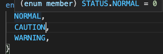
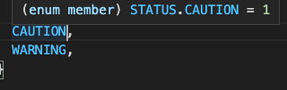

# Enum

関連する値の集合を編成する方法です。`C`や`Java`などは`enum`型を持っていますが、`JavaScript`にはありません。

## Enumの書き方

`enum`を書く前に、例を見てみましょう。

下記のモジュールは実は予防保全に使われている劣化度の判断モジュールです。

```javascript
function getAlert(status) {
  if (status === 0) {
    return 'Normal';
  }
  if (status === 1) {
    return 'Caution';
  }
  if (status === 2) {
    return 'Warning';
  }
  return 'Error';
}
```

このような書き方はあまり直感的ではありません。まず各コードの意味を理解しなければいけません。また、メンテナンス性も悪いです。もしコードを変更した場合、コードが使用されている場所はすべてチェックする必要があり、ロジックを変更しないといけません。一般的に状態を表す静的オブジェクトを作成して、関連データを集合して編成します。

```javascript
const STATUS = {
  NORMAL: 0,
  CAUTION: 1,
  WARNING: 2,
};
```

```diff
  function getAlert(status) {
-   if (status === 0) {
+   if (status === STATUS.NORMAL) {
      return 'Normal';
    }
-  if (status === 1) {
+  if (status === STATUS.CAUTION) {
      return 'Caution';
    }
-   if (status === 2) {
+   if (status === STATUS.WARNING) {
      return 'Warning';
    }
    return 'Error';
  }
```

そうすることで、コードがよくわかるようになりました。またコード変更してもロジックに影響しないというメリットがあります。

`TypeScript`にもっとやりやすい`Enum`型があります。

```typescript
enum STATUS {
  NORMAL,
  CAUTION,
  WARNING,
}

function getAlert(status: STATUS) {
  if (status === STATUS.NORMAL) {
    return 'Normal';
  }
  if (status === STATUS.CAUTION) {
    return 'Caution';
  }
  if (status === STATUS.WARNING) {
    return 'Warning';
  }
  return 'Error';
}
```

ここでの`NORMAL`のデフォルト値は`0`で、続いて`CAUTION`と`WARNING`は連番のため、`1`と`2`になります。




`Enum`のメンバーの数値も指定できます。

```typescript
enum STATUS {
  NORMAL = 1,
  CAUTION, // 2
  WARNING, // 3
}
```

先頭だけではなく、他のメンバーからも指定することも可能です。

```typescript
enum STATUS {
  NORMAL, //0
  CAUTION = 500,
  WARNING, // 501
}
```

内部値でメンバーも取得することも可能です。

```typescript
console.log(STATUS[500]);
```
