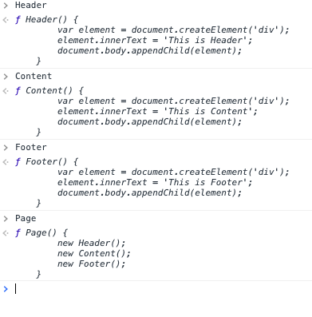
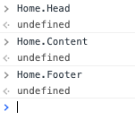
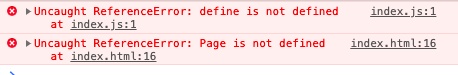

# モジュール化

ある機能を実現するための関数群や、データの集合などを、他のものとは独立して閉じた形で扱えるように構成することを`モジュール化`と呼びます。

TypeScriptでのモジュール化は主に二つの方法があります：

1. namescpace
2. module

## namespace

名前空間は、グローバルな名前空間内でJavaScriptのオブジェクトに単純に名前が付けられたものです。 これは、名前空間を使用するにあたり、非常にシンプルな構成にしてくれます。

### Namespaceで解決できる課題

ウェブ画面の構成では、`Header`、`Content`、`Footer`の三階層はよく使われています。下記の例はOPPで画面構成をしています。

```typescript
class Header {
  constructor() {
    const element = document.createElement('div');
    element.innerText = 'This is Header';
    document.body.appendChild(element);
  }
}

class Content {
  constructor() {
    const element = document.createElement('div');
    element.innerText = 'This is Content';
    document.body.appendChild(element);
  }
}

class Footer {
  constructor() {
    const element = document.createElement('div');
    element.innerText = 'This is Footer';
    document.body.appendChild(element);
  }
}

class Page {
  constructor() {
    new Header();
    new Content();
    new Footer();
  }
}
```

`index.html`で`new Page()`を利用してページを作成します。

```diff
  <script src="./dist/index.js"></script>
+ <script>new Page()</script>
```

一見すると上記のコードには何の問題もありませんが、`dist/index.js`を見ると、`Header`、`Content`、`Footer`はグローバル変数になってしまいました。`Chrome`の`DevTool`でも、`Header`、`Content`、`Footer`の本体を出力することができます。



これは次の2つの課題を引き起こします。

1. グローバル変数が多くなります。グローバル変数が増えれば増えるほど、コードのメンテナンス性が悪くなる可能性があります。
2. ライブラリは公開したくないコンテンツ（`Header`、`Content`、`Footer`）も見ることが可能です。

`namespace`は上記の問題を解決するためによく使用されます。

`Home`という`namespace`を作成しましょう。

```typescript
namespace Home {
  class Header {
    constructor() {
      const element = document.createElement('div');
      element.innerText = 'This is Header';
      document.body.appendChild(element);
    }
  }

  class Content {
    constructor() {
      const element = document.createElement('div');
      element.innerText = 'This is Content';
      document.body.appendChild(element);
    }
  }

  class Footer {
    constructor() {
      const element = document.createElement('div');
      element.innerText = 'This is Footer';
      document.body.appendChild(element);
    }
  }

  class Page {
    constructor() {
      new Header();
      new Content();
      new Footer();
    }
  }
}
```

`Page`はAPIとして公開します。

```diff
- class Page {
+ export class Page { 
    constructor() {
      new Header();
      new Content();
      new Footer();
    }
  }
```

使用方法も変更が必要です

```diff
- <script>new Page()</script>
+ <script>new Home.Page()</script>
```

`Home`という`namespace`を設置することで、メリットは

1. モジュール化（コンポーネント）することで、メンテナンス性が向上
2. グローバル変数の削減
3. 公開したくないコンテンツを隠蔽することができます



### 複数のnamespaceの使用

上記のソースは、コンポーネントロジックと画面ロジックを単一のファイルに書き込んでいますが、そのロジックを分離しましょう。今回`components`の`namespace`を作成し、`Header`、`Content`、`Footer`を`components`に移動しましょう。

```typescript
// components.ts
namespace Components {
  export class Header {
    constructor() {
      const element = document.createElement('div');
      element.innerText = 'This is Header';
      document.body.appendChild(element);
    }
  }

  export class Content {
     constructor() {
      const element = document.createElement('div');
      element.innerText = 'This is Content';
      document.body.appendChild(element);
    }
  }

  export class Footer {
    constructor() {
      const element = document.createElement('div');
      element.innerText = 'This is Footer';
      document.body.appendChild(element);
    }
  }
}
```

`index.js`に画面ロジックも修正します。

```diff
  export class Page { 
    constructor() {
-     new Header();
-     new Content();
-     new Footer();
+     new Components.Header();
+     new Components.Content();
+     new Components.Footer();
    }
  }
```

> 注: `index.ts`に`/// <reference>` によるモジュールの参照先を明記すること（可読性向上）。

```diff
+ /// <reference path="./components.ts" />

  namespace Home {
```

### 入れ子になったnamespace

TypeScript では、別の名前空間の中に名前空間を追加することで、入れ子になったカプセル化を作成することもできます。外部に公開されるネストされた名前空間の前には、export キーワードを付けなければなりません。

```typescript
namespace Components {
  export namespace SubComponents {
  }
}
```

## module

名前空間のように、モジュールはコードと宣言の両方を含みます。 両者の主な違いは、モジュールはそれらの依存性を宣言することにあります。

### namespaceの課題

```typescript
/// <reference path="./components.ts" />

namespace Home {
  export class Page {
    constructor() {
      new Components.Header();
      new Components.Content();
      new Components.Footer();
    }
  }
}
```

上記のソースコードでは、`Components`を使いますが、その中身を`components.ts`から見つけないといけません。大規模なライブラリだと、その中のメンバーの探すのは非常に難しいです。
モジュールはNode.jsアプリケーションにおいても覚えておく価値のあるもので、 デフォルトで用意されており、モジュールを使用したコード構築が推奨されています。

> ・現在、ts-lintでno-namespaceというルールがあります、S6-style moduleを推奨しています。しかし、今後外部APIを記述するためのd.tsファイルでnamespaceは不可欠のため、namespaceの知識が必要です。
>
> ・no-namespaceルールが存在しますが、使用できないというわけではありません。今後も使えなくなる可能性は低いです。下記はTypeScriptの開発者がnamespaceに対するコメントです。

[Microsoft/TypeScript/issue/30994](https://github.com/microsoft/TypeScript/issues/30994#issuecomment-492017219)

### ES6-style moduleの書き方

1. まず、`components.ts`のメンバーをエクスポートしましょう

    ```typescript
    export class Header {
      constructor() {
        const element = document.createElement('div');
        element.innerText = 'This is Header';
        document.body.appendChild(element);
      }
    }

    export class Content {
      constructor() {
        const element = document.createElement('div');
        element.innerText = 'This is Content';
        document.body.appendChild(element);
      }
    }

    export class Footer {
      constructor() {
        const element = document.createElement('div');
        element.innerText = 'This is Footer';
        document.body.appendChild(element);
      }
    }
    ```

2. `index.ts`でモジュールをインポートします。

    ```diff
    - /// <reference path="./components.ts" />
    + import { Header, Content, Footer } from './components';

    - namespace Home {
    export class Page {
      constructor() {
    -   new Components.Header();
    -   new Components.Content();
    -   new Components.Footer();
    +   new Header();
    +   new Content();
    +   new Footer();
      }
    }
    - }
    ```

3. `index.html`で使用方法を修正

    ```diff
    + <script>new Home.Page()</script>
    - <script>new Page()</script>
    ```

上記のソースコードは正しく改造しましたが、コンパイルされた`index.js`はブラウザーでエラーが起こりました。



原因は、`TypeScript`のソースを一つのファイルにコンパイルする際に、`amd`標準を使わないといけません。`amd`標準で実装された`RequireJS`における`define`関数はブラウザーではサポートされません。

> レファレンス:
>
> - [CommonJS](https://nodejs.org/docs/latest/api/modules.html)
> - [RequireJS](https://requirejs.org/)

### プログラムを最後まで動かす

以下の内容は、`TypeScript`と関係がありません、また`RequireJS`の知識が必要です。

1. ブラウザが`RequireJS`をサポートするように、`index.html`に`require.js`をインポート

    ```diff
    + <script src="https://cdnjs.cloudflare.com/ajax/libs/require.js/2.3.6/require.min.js"></script>
      <script src="./dist/index.js"></script>
    ```

2. `index.html`で使用方法を変更

    ```diff
    - <script>new Page()</script>
    + <script>
    +   require(['index'], function (index) {
    +     new index.Page();
    +   });
    + </script>
    ```

> 注: フロントエンド開発で、ネイティブディベロップメントではない限り、上記の作業全部フレームワークかWebpackでやってもらいますので、開発者自身に負担がかかりません。
