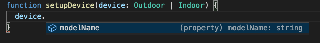

# タイプガード

TypeScript のユニオン型は、タイプの保護を必要とします。

まず例をみてみましょう。

2つのインタフェースを定義します。一つは室外機、もう一つは室内機、両方モデル名ーのメンバーを持っていますが、室外機は低騒音の機能を持っており、室内機は人検知機能を持っています。次に、関数を定義します。役割はエアコンの組み立てをします。

```typescript
interface Outdoor {
  modelName: string;
  lowNoise: () => {};
}

interface Indoor {
  modelName: string;
  humanSensor: () => {};
}

function setupDevice(device: Outdoor | Indoor) {}
```

関数体に`device`を入力すると`modelName`しか使えません。



このような構文は`device`の`lowNoise`か`humanSensor`かを判断できません。

解決策としてタイプガードを使いましょう。

## タイプガードの種類

### [タイプアサーション](https://www.typescriptlang.org/docs/handbook/basic-types.html#type-assertions)

```typescript
function setupDevice(device: Outdoor | Indoor) {
  if (device.modelName === 'Outdoor') {
    (device as Outdoor).lowNoise;
  } else if (device.modelName === 'Indoor') {
    (device as Indoor).humanSensor;
  } else {
    console.log('Error');
  }
}
```

ここでモデル名を使って室外機と室内機を判断し、タイプを保護します。
>タイプアサーションを使用するには、コードのロジックや仕様をちゃんと理解する必要があります。

### in演算子

```typescript
function setupDevice(device: Outdoor | Indoor) {
  if ('lowNoise' in device) {
    device.lowNoise();
  } else {
    device.humanSensor();
  }
}
```

ここで、`device`に`lowNoise`のメンバーがあれば室外機で、そうでない場合は室内機です。

### typeof演算子

```typescript
function sum(a: string | number, b: string | number) {
  let tempA = 0;
  let tempB = 0;

  tempA = typeof a === 'string' ? parseInt(a, 10) : a;
  tempB = typeof b === 'string' ? parseInt(b, 10) : b;

  return tempA + tempB;
}
```

ここで、a+bを計算するときに、引数は文字列と数字両方対応する際、`typeof`で型を判断することで、タイプ保護の目的を達成します。

### instanceof演算子

```typescript
class Data {
  constructor(public counter: number) {}
}

function sum(a: object | Data, b: object | Data) {
  if (a instanceof Data && b instanceof Data) {
    return a.counter + b.counter;
  }
  return 0;
}
```

ここで、`instanceof`で`Data`のインスタンスを判断することで、タイプ保護の目的を達成します。
