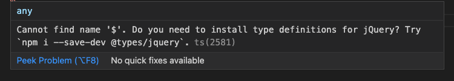
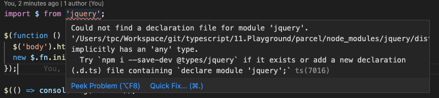

# 型定義ファイル（DTS）

TypeScriptのプロジェクトに他のJavaScriptライブラリをインポートすると、エラーが起こります。原因は、JavaScriptのライブラリに型の宣言などがないからです。こんな時、型定義ファイル（.d.ts）ファイルが必要です。そのファイルの役割はJavaScriptライブラリを解釈して`TypeScript`に伝えることです。

## d.tsファイルを取得

### @types

[@types](https://github.com/DefinitelyTyped/DefinitelyTyped)をダウンロードします。コミュニティは効率的にトップ`JavaScript`ライブラリのほぼ90％の型ドキュメントを作成してくれました。

```bash
npm install @types/xxx -D
```

`xxx`は`JavaScript`のライブラリ名です。

### 自作

自社で作ったライブラリの対応、またはコミュニティに貢献したい場合、DTSを自作するしかありません。ここで、`jQuery`のDTSを作成して、どういうふうにDTSを作成するのかを覚えましょう。

ここで、`parcel`の`playground`がお勧めです。

まず、`public/index.html`に`jQuery`の`cdn`をインポートしましょう。

```diff
  <body>
  <script
+     src="https://code.jquery.com/jquery-3.5.1.slim.min.js"
+     integrity="sha256-4+XzXVhsDmqanXGHaHvgh1gMQKX40OUvDEBTu8JcmNs="
+     crossorigin="anonymous"
+   ></script>
    <script src="../src/index.ts"></script>
  </body>
```

次に、`src/index.ts`に`jQuery`のコードを書きましょう。

```typescript
$(function(){
  console.log('Hello jQuery');
});
```



ここで、`jQuery`の`$`関数を使うと、DTSがないため、`TypeScript`は`$`を理解できないです。

`src`の配下に`jquery.d.ts`を作成します。

#### グローバル変数

`$`関数の引数は関数、戻り値はないため、下記のように書きましょう。

```typescript
declare var $: (param: () => void) => void;
```

ここで、`declare var`を使うことで、グローバル変数`$`の型を定義しました。

#### グローバル関数

`$`を`declare function`でグローバル関数として定義することができます。

```typescript
declare function $(param: () => void): void;
```

#### 関数のオーバーロード

画面上に`html`要素を作成しましょう。

```diff
  $(function(){
-   console.log('Hello jQuery');
+   $('body').html('<h1>Hello TypeScript!</h1>');
  });
```

現在`$()`のパラーメーターは文字列なので、DTSにそういった定義はないため、エラーが起こります。まずパラメータを追加しましょう。

```diff
  declare function $(param: () => void): void;
+ declare function $(param: string)
```

次に`$()`の戻り値は`html()`を持っているオブジェクトですので、`$(param: string)`の戻り値のタイプを追加しましょう。

```diff
  declare function $(param: () => void): void;
- declare function $(param: string)
+ declare function $(
+   param: string
+ ): { html: }
```

次に、`html`はパラメータが文字列の関数ですので、さらに改造しましょう。

```diff
  declare function $(
    param: string
- ): { html: }
+ ): { html: (param: string)}
```

`jQuery`サイトで、`html`関数の戻り値は`jQuery`のインスタンスですが、インスタンスはオブジェクトなので、とりあえず`{}`と設定しましょう。

```diff
  declare function $(
    param: string
- ): { html: (param: string)}
+ ): { 
+   html: (param: string) => {};
+ }
```

ここで、`$`関数を二重定義しましたが、関数のオーバーロードのため問題はないです。

次に、`interface`を用いてソースを最適化しましょう。また、名前も変更しましょう。

```diff
+ interface JqueryInstance {
+   html: (html: string) => JqueryInstance;
+ }
+
- declare function $(param: () => void): void;
+ declare function $(readyFunction: () => void): void;
- declare function $(
-   param: string
- ): {
-   html: (param: string) => {};
- };
+ declare function $(selector: string): JqueryInstance;
```

#### `interface`を用いた関数のオーバーロード

```diff
- declare function $(readyFunction: () => void): void;
- declare function $(selector: string): JqueryInstance;
+ // declare function $(readyFunction: () => void): void;
+ // declare function $(selector: string): JqueryInstance;

+ interface JQuery {
+   (readyFunction: () => void): void;
+   (selector: string): JqueryInstance;
+ }

+ declare var $: JQuery;
```

ここで、JQueryのインターフェースを定義し、実現できる関数を網羅することで、関数のオーバーロードも実現することができます。

#### オブジェクトの定義

まず、`index.ts`を改造しましょう。

```diff
  $('body').html('<h1>Hello TypeScript!</h1>');
+ new $.fn.init();
```

`$.fn.init()`は`jQuery`のインスタンスを作成することです。その中の`init()`はコンストラクターです。

ここで、`$`は関数ではなく、オブジェクをとして使われるので、オブジェクトの定義に`namespace`を使います。
まず、グローバル関数の定義を復活させましょう。

```diff
- // declare function $(readyFunction: () => void): void;
- // declare function $(selector: string): JqueryInstance;
+ declare function $(readyFunction: () => void): void;
+ declare function $(selector: string): JqueryInstance;

- interface JQuery {
-   (readyFunction: () => void): void;
-   (selector: string): JqueryInstance;
- }

- declare var $: JQuery
```

次に、`declare namespace`で`$`の`namespace`を定義しましょう。

```diff
  declare function $(selector: string): JqueryInstance;
+ declare namespace $ {
+ 
+ }
```

`$`オブジェクトにまた`fn`というオブジェクが存在しますので、もう一つオブジェクトを定義しましょう。

```diff
  declare namespace $ {
-
+   namespace fn {
+   
+   }
  }
```

`new`演算子使っているので、`init`をクラスとして定義しましょう。

```diff
  declare namespace $ {
    namespace fn {
-
+     class init {}
    }
  }
```

## DTSのモジュール化

以上の内容は、`jQuery`を`html`でインポートされますが、今回`module`としてインポートします。

>この講義のモジュール化標準はes6の標準を採用しています。

まず、`index.html`の`jQuery`ライブラリを削除します。

```diff
- <script
-      src="https://code.jquery.com/jquery-3.5.1.slim.min.js"
-      integrity="sha256-4+XzXVhsDmqanXGHaHvgh1gMQKX40OUvDEBTu8JcmNs="crossorigin="anonymous">
- </script>
  <script src="../src/index.ts"></script>
```

次に、`npm i jquery --save`を発行して`jQuery`のモジュールをインストールします。

そして、`index.ts`に`$`をインポートしましょう。

```diff
+ import $ from 'jquery';

  $(function () {
```

ここで、まだ`d.ts`ファイルがないというエラーが出ています。



なぜ`jquery.d.ts`があるのに、エラーが起こっているのでしょうか。原因は私たちが作った`d.ts`ファイルがモジュール化されていないからです。

`declare module`で`module`を定義しましょう。

```typescript
declare module 'jquery' {
  interface JqueryInstance {
    html: (html: string) => JqueryInstance;
  }
  function $(readyFunction: () => void): void;
  function $(selector: string): JqueryInstance;
  namespace $ {
    namespace fn {
      class init {}
    }
  }
}
```

最後に、`$`を`export`します。

```diff
  namespace $ {
    namespace fn {
      class init {}
    }
  }
+ export = $;
```
