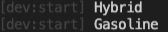
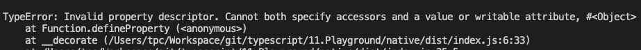
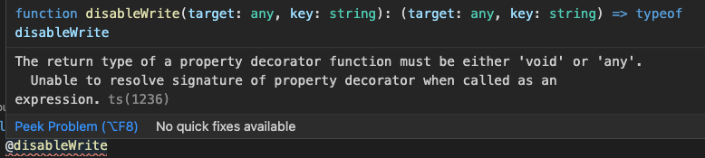

# デコレーター

`TypeScript`と`ES6`にクラスが導入されたことで、クラスやクラスメンバーのアノテーションや修正をサポートするための追加機能を必要とするシナリオが存在するようになりました。 デコレータは、クラス宣言とメンバのための注釈とメタプログラミング構文の両方を追加する方法を提供します。デコレーターは`TypeScript`の試験機能ですが、`Angular`では、単なるクラスを`Angular`で使えるコンポーネントとしてその役割を担わせる時などにデコレータを使用したりします。非常に大事な知識になるため、その仕組みを理解しましょう。

デコレーターを使うために、`tsconfig.json`に`xperimental support`を有効にしましょう。

```diff
  /* Experimental Options */
- // "experimentalDecorators": true,   /* Enables experimental support for ES7 decorators. */
- // "emitDecoratorMetadata": true,    /* Enables experimental support for emitting type metadata for decorators. */
+ "experimentalDecorators": true,      /* Enables experimental support for ES7 decorators. */
+ "emitDecoratorMetadata": true,       /* Enables experimental support for emitting type metadata for decorators. */
```

## デコレーターとは

デコーダーは、既存のソースコードを編集するための機能です。

以下のような場合に使用します。

1. 重複している例外処理をまとめて、コードを削減する
2. 関数の性能評価
3. Debugメッセージを出力する

デコレーターを使用する場合の注意事項は以下の通りです。

1. デコレーターは関数
2. `@`でデコレーターを使用
3. 宣言の直前で実行
4. 実行順番: 近い順に実行

## クラス・デコレーター

クラス宣言の直前で実行します。クラス・デコレーターはクラスのコンストラクタに適用され、クラスの定義の検査、修正、置換に使われます。以下の例を見て見ましょう。

```typescript
function createGasoline(constructor: any) {
  console.log('Gasoline');
}

function createHybrid(constructor: any) {
  console.log('Hybrid');
}

@createGasoline
@createHybrid
class Car {}
```

その実行結果



> ここでは取り敢えず`any`を使います、後で直します。

上記の例を見ながら、デコレーターの概念もう一度見てみましょう。

1. デコレーターは関数　→　`createGasoline`と`createHybrid`は関数です。
2. `@`でデコレーターを使用　→　`@createHybrid`
3. 宣言の直前で実行 →

    ```typescript
    @createGasoline
    @createHybrid
    class Car {}
    ```

4. 近い順に実行 →　出力はまずは`Hybrid`、次は`Gasoline`

5. （特有）クラスのデコレーターのパラメーターはクラスのコンストラクターです。

    ```diff
      function createGasoline(constructor: any) {
    -   console.log('Gasoline');
    +   constructor.prototype.getCarName = () => console.log('GTR');
      }
    ```

    ```diff
      class Car {}

    + const car = new Car();
    + (car as any).getCarName();
    ```

### ファクトリーモデル

デコレータが宣言に適用される方法をカスタマイズしたいなら、デコレータ・ファクトリーを書くことができます。
お客さんは車を買うときに、車がどのように作られているか、正確な実装を気にすることなく、工場から直接引き取るとします。

```typescript
function factories(type: string) {
  if (type === 'Gasoline') {
    return function (constructor: any) {
      constructor.prototype.getCarName = () => console.log('GTR');
    };
  }
  if (type === 'Hybrid') {
    return function (constructor: any) {
      constructor.prototype.getCarName = () => console.log('Prius');
    };
  }
  return function (constructor: any) {};
}

@factories('Hybrid')
class Car {}

const car = new Car();
(car as any).getCarName();

```

ここで、`GTR`か`Prius`かの生産を気にしないで、`@factories()`で車の種類を制御します。

### オーバーライド

従来のクラスをオーバーライドのときに、デコレーターを使いましょう

まず、下記のデコレーターを改造しましょう

```typescript
function createGasoline(constructor: any) {
  constructor.prototype.carName = 'Prius';
}

@createGasoline
class Car {
  constructor(public carName: string){}
}

const car = new Car('GTR');
console.log(car.carName);
```

次に、`Generic`を使って、`any`を交代します。

```diff
- function createGasoline(constructor: any) {
+ function createGasoline<T>(constructor: T) {
```

さらに、`T`を拡張します。

```diff
- function createGasoline<T>(constructor: T) {
+ function createGasoline<T extends new (...args: any[]) => {}>(constructor: T) {
```

>`<T extends new (...args: any[]) => {}>`の理解: Tはコンストラクターを持っているオブジェクトであり、つまりクラスです。

次に、`carName`を書き換えをします。

```diff
function createGasoline<T extends new (...args: any[]) => {}>(constructor: T) {
  return class extends constructor {
    carName = 'Prius';
  }
}
```

>以上のオーバーライドは、すでに存在するメンバーを対象にします。新しく追加されたメンバーのときにはデコレーターを使いません。どうしても使いたい場合、デコレーターを関数として使います。その内容はあまり使われないので、略します。

## メソッド・デコレーター

クラスのメソッドの宣言の直前で使用され、メソッドの定義の検査、修正、置換に使われます。
下記のソースコードを見てみましょう。

```typescript
class Car {
  constructor(public carName: string) {}
  getName() {
    return this.carName;
  }
}

const car = new Car('GTR');
console.log(car.getName());

car.getName = () => 'Prius';
console.log(car.getName());
```

`getName`は改竄され、違う情報が出力されています。では、メソッド・デコレーターを使って、メソッド改竄しないように修正しましょう。

```diff
+ function disableWrite(
+   target: any,
+   key: string,
+   descriptor: PropertyDescriptor
+ ) {
+   descriptor.writable = false;
+ }
  class Car {
    constructor(public carName: string) {}

+   @disableWrite
    getName() {
      return this.carName;
    }
  }
```

メソッドの`descriptor`を通じて、オーバーライドできないように修正しました。

メソッド・デコレーターはクラスを宣言完了後すぐ実行されます、そのパラメーターは三つあります。

- target:
  - class methodの場合、クラスの`prototype`
  - static methodの場合、クラスのコンストラクター
- key: 関数名
- descriptor: プロパティの記述子（[defineProperty()](https://developer.mozilla.org/ja/docs/Web/JavaScript/Reference/Global_Objects/Object/defineProperty)）と同じです。

### アクセサ・デコレータ

アクセサ（`getter`と`setter`）もあります。それはメソッド・デコレータと同じです。上記の例を改造しましょう。

```diff
  class Car {
-   constructor(public carName: string) {}
+   constructor(private __carName: string) {}

    @disableWrite
-   getName() {
+   set name(name: string) {
+     this.__carName = name;
    }
  }
+ const car = new Car('GTR');
+ car.name = 'Prius';
```

実行すると、エラが起こります。



> 注意：単一のメンバに対してgetとsetの両方のアクセサを装飾することはできません。 代わりに、メンバのすべてのデコレータをドキュメント順で最初に指定されたアクセサに適用させる必要があります。 → [Reference](https://www.typescriptlang.org/docs/handbook/decorators.html#accessor-decorators)

### プロパティ・デコレータ

デコレータを使ってクラスのプロパティも修飾可能。

```typescript
function disableWrite(target: any, key: string) {}

class Car {
  @disableWrite
  carName = 'Prius';
}
```

メソッド・デコレータと異なって、プロパティ・デコレータは`descriptor`を持っていません。しかし、プロパティ自体が`descriptor`を持っていますので、ここでデコレータを用いて`descriptor`の値を変更することができます。

```diff
- function disableWrite(target: any, key: string) {}
+ function disableWrite(target: any, key: string) {
+   const discriptor: PropertyDescriptor = {
+     writable: false,
+   };
+   return disableWrite;
+ }
```

ここで、エラーが起こっていますが、プロパティ・デコレータのタイプは`void`か`any`かのどちらかです。



```diff
- function disableWrite(target: any, key: string) {
+ function disableWrite(target: any, key: string): any {
```

#### メンバーの修飾

クラスの`prototype (target)`と`key`を取得できる以上、クラスのプロパティを修飾できます。

```diff
- function disableWrite(target: any, key: string): any {
+ function disableWrite(target: any, key: string): void {
-   const discriptor: PropertyDescriptor = {
-     writable: false,
-   };
-   return disableWrite;
+   target[key] = 'GTR';
  }

  class Car {
    @disableWrite
    carName = 'Prius';
  }

+ const car = new Car()
+ console.log(car.carName);
```

結果を見ると、`Prius`のまま表示されています。

実際に、`dist/index.js`のコンパイル結果を見るとすぐわかるでしょう。

```javascript
var Car = /** @class */ (function () {
    function Car() {
        this.carName = 'Prius';
    }
    __decorate([
        disableWrite,
        __metadata("design:type", Object)
    ], Car.prototype, "carName", void 0);
    return Car;
}
```

`console.log(car.carName)`の`carName`はインスタンス上のcarName、デコレータで修正された`carName`は`prototype`上の`carName`です。`prototype`上の`carName`を出力するときは、`__prot__`を使いましょう。

```diff
- console.log(car.carName);
+ console.log((car as any).__proto__.carName);
```

### reflect-metadata

[メタデータ](https://ja.wikipedia.org/wiki/%E3%83%A1%E3%82%BF%E3%83%87%E3%83%BC%E3%82%BF)、メタ情報とは、メタなデータ、すなわちデータについてのデータという意味で、あるデータが付随して持つそのデータ自身についての付加的なデータを指します。

TypeScriptでメタデータを使用することができます。利用する際、`reflect-metadata`というライブラリをインストールをし、インポートしましょう

```bash
npm i refelct-metadata --save
```

```typescript
import 'reflect-metadata';
```

```typescript
const user = {
  name: 'Kondo',
}

Reflect.defineMetadata('role', 'FGL engineer', user);
console.log(user);
console.log(Reflect.getMetadata('role', user));
```

この例はメタデータの一番簡単な例で、`Reflect`の`defineMetadata`APIを使うことで、オブジェクトに`role`という属性をアタッチすることができました。

クラスにメタデータをアタッチする場合、`Reflect`ではデコレータを用意してくれたので、直接に使うことができます。

```typescript
@Reflect.metadata('role', 'FGL engineer')
class User {
  name = 'Kondo';
}

console.log(Reflect.getMetadata('role', User));
```

### パラメータ・デコレータ

クラス内の関数のパラメータでも、デコレータで修飾できます。パラメータのデコレータのパラメータは

1. target:
   - 静的メソッドの場合、クラスのコンストラクター
   - クラスメソッドの場合、クラスのプロトタイプ
2. propertyKey: このパラメータを使用するメソッド名
3. parameterIndex: 関数のパラメータリストのパラメータのインでクス

```typescript
function paramDecorator(target: any, propertyKey: string, parameterIndex: number) {
  console.log(target, propertyKey, parameterIndex);
}

class User {
  name = 'Kondo';

  getName(@paramDecorator key: string, value: string) {
    console.log(this.name);
  }
}
```

では、メソッドデコレータ、パラメータデコレータ及びメタデータを用いてメソッドの検証機能を実現しましょう。

```typescript
class User {
  constructor(public name: string) {}

  getName(token: string) {
    if (token === '123') {
      return this.name;
    }
  }
}
```

`getName()`の`token`が不可欠なので、`required`で修飾し、`token`はないときにエラーが出力するように、アウトプットイメージはこんな感じです。

```diff
  class User {
    constructor(public name: string) {}

+   @validator
-   getName(token: string) {
+   getName(@required token: string) {
      if (token === '123') {
        return this.name;
      }
    }
  }
```

デコレータをまず枠を作ります

```typescript
function required(target: any, propertyName: string, parameterIndex: number) {}

function validator(
  target: any,
  propertyName: string,
  descriptor: PropertyDescriptor<Function>
) {}
```

ここで、`existingRequiredParameters`というリストを作成して、中身はメソッドに必須であるパラメータのインでクスを保存して、さらにこのリストを`required`というメタデータとしてgetNameの配下にアタッチする。

```typescript
function required(target: any, propertyKey: string, parameterIndex: number) {
  let existingRequiredParameters: number[] =
    Reflect.getOwnMetadata('required', target, propertyKey) || [];
  existingRequiredParameters.push(parameterIndex);

  Reflect.defineMetadata(
    'required',
    existingRequiredParameters,
    target,
    propertyKey
  );
}
```

getNameで、まず自分自身の`required`のメタデータを見て、そのリストの中にのインでクスに対応するパラメータがあるかをみて、`undefined`であればエラーを出力し、そうではなければ、メソッドを実行します。

```typescript
function validator(
  target: any,
  propertyName: string,
  descriptor: PropertyDescriptor
) {
  let fn = descriptor.value;
  descriptor.value = function () {
    let requiredParameters: number[] = Reflect.getOwnMetadata(
      'required',
      target,
      propertyName
    );
    if (requiredParameters) {
      for (let index of requiredParameters) {
        if (index >= arguments.length || arguments[index] === undefined) {
          throw new Error('Missing required argument');
        }
      }
    }
    return fn.apply(this, arguments);
  };
}
```
